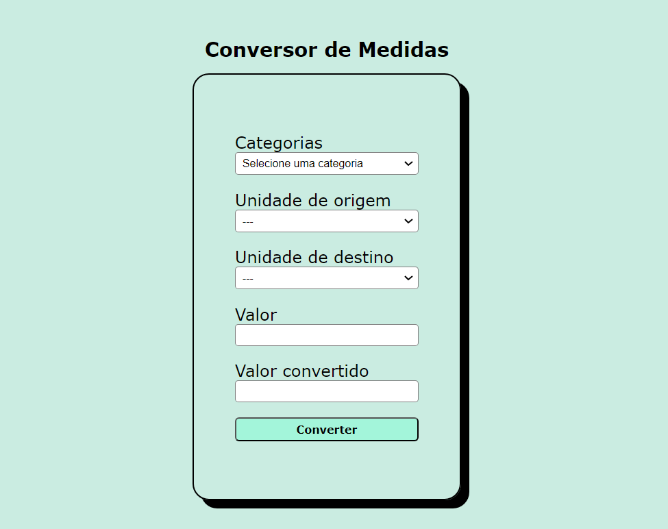

## conversorDeMedidas
Este projeto tem como finalidade criar um conversor de medidas,(utilizando html, css e JavaScript) as quais são: comprimento, peso e temperatura.

Utilizei um evento de escuta para que as opções apareçam deforma dinâmica na tela do usuário e também duas funções importantes: uma de verificação de preenchimento dos campos do formulário e outra para limpar o resultado assim que uma mudança de seleção ocorre.

## Images

